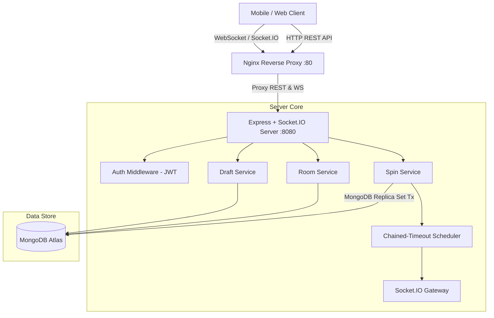
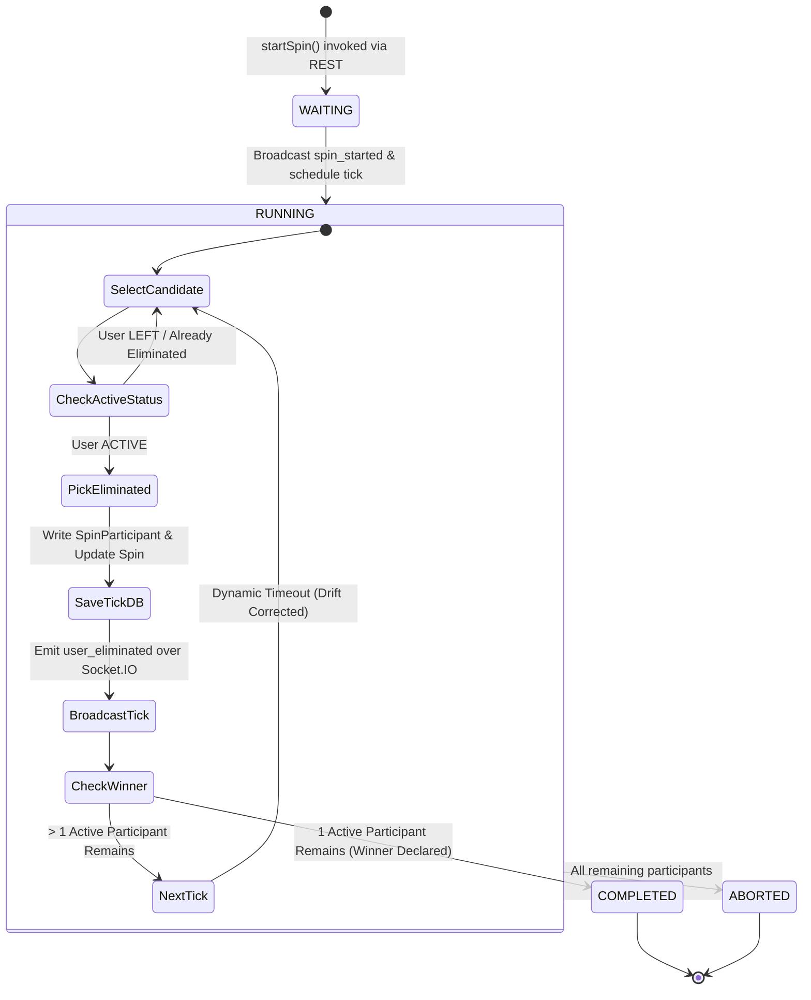

# Roxstar Backend Architecture & System Design

## 1. Executive Summary

Roxstar is a real-time multiplayer backend for music draft elimination games. It handles user authentication, room lifecycle management, draft state sharing, and a real-time random participant spin elimination engine built over Node.js, Express, Socket.IO, and MongoDB Atlas.

---

## 2. System Component Architecture



---

## 3. Spin Lifecycle State Machine



---

## 4. Key Architectural Decisions & Solutions

### A. Database-Enforced Single Active Spin Rule
To strictly prevent concurrent or duplicate spins within a room (even across distributed server instances or race conditions), the `Spin` collection uses a **Partial Unique Index**:
```js
{ roomId: 1 },
{ unique: true, partialFilterExpression: { status: { $in: ['WAITING', 'RUNNING'] } } }
```
- **Result:** MongoDB enforces at the database storage engine layer that at most one spin document with `status` in `['WAITING', 'RUNNING']` can exist per `roomId`.
- Duplicate attempts fail immediately with E11000 duplicate key error, which the backend translates into a deterministic `409 SPIN_ALREADY_ACTIVE` domain error.

### B. MongoDB Atlas Multi-Document Transaction Retries
Spin state transitions (participant eligibility validation, spin record creation, and status updates) are executed within MongoDB multi-document ACID transactions.
- In MongoDB Atlas replica sets, concurrent transactions may throw `TransientTransactionError` / `WriteConflict` (code 112).
- The service incorporates `runWithTransactionRetry(fn)` which catches transient transaction errors and automatically retries up to 3 times with exponential backoff and clean session recreation.

### C. Chained-Timeout Spin Scheduler with Drift Correction
Instead of `setInterval` (which suffers from timer drift and overlapping ticks), the spin engine uses a **chained recursive `setTimeout`** design with active delay calculation:
- `delay = max(0, SPIN_INTERVAL_MS - elapsedTimeMs)`
- Guarantees exact, predictable cadence without tick overlap.
- Configured dynamically via `process.env.SPIN_INTERVAL_MS` (5000ms default, 100ms in automated test environment).

### D. Server Boot Recovery (`recoverUnfinishedSpins`)
If the node process restarts mid-spin (crash or deployment rollout):
- Upon boot, `recoverUnfinishedSpins()` queries MongoDB for any spins stuck in `WAITING` or `RUNNING` status.
- It resumes the chained-timeout loop for each unfinished spin, ensuring no game is left in a zombie state.

---

## 5. Data Model Schemas & Relationships

- **User:** `_id`, `displayName`, `createdAt`, `updatedAt`
- **Room:** `_id`, `code` (6-char unique uppercase), `ownerId` -> User, `status` (`ACTIVE`, `ARCHIVED`), `members` -> `[RoomMemberSchema]` (`userId`, `role`, `status` (`ACTIVE`, `LEFT`), `joinedAt`, `leftAt`)
- **Draft:** `_id`, `roomId` -> Room, `ownerId` -> User, `title`, `items` (`[DraftItemSchema]`), `sharedAt`, `createdAt`
- **Spin:** `_id`, `roomId` -> Room, `status` (`WAITING`, `RUNNING`, `COMPLETED`, `ABORTED`), `winnerUserId` -> User, `totalParticipants`, `eliminatedCount`, `currentStep`, `startedAt`, `completedAt`
- **SpinParticipant:** `_id`, `spinId` -> Spin, `userId` -> User, `status` (`ACTIVE`, `ELIMINATED`), `eliminationOrder` (1-indexed number or null), `eliminatedAt`
